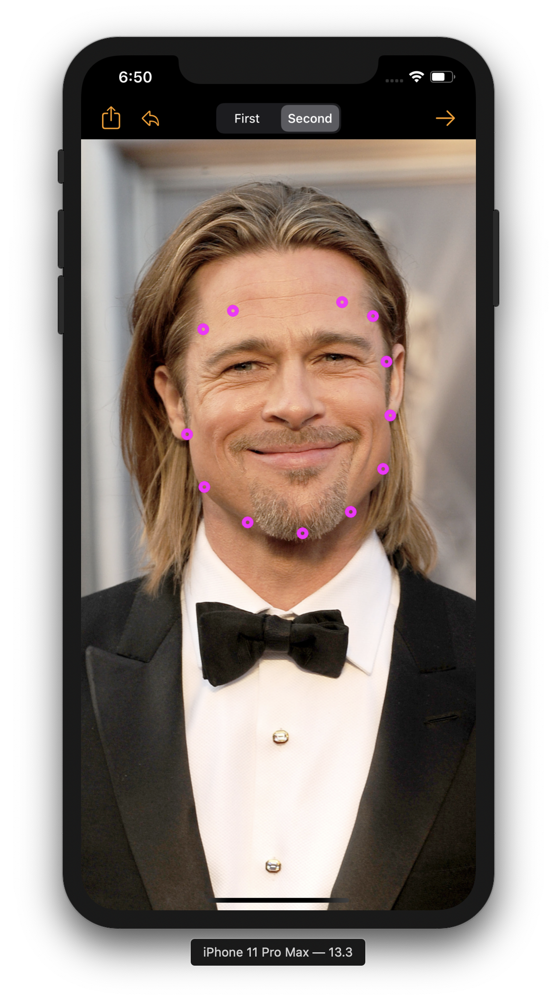
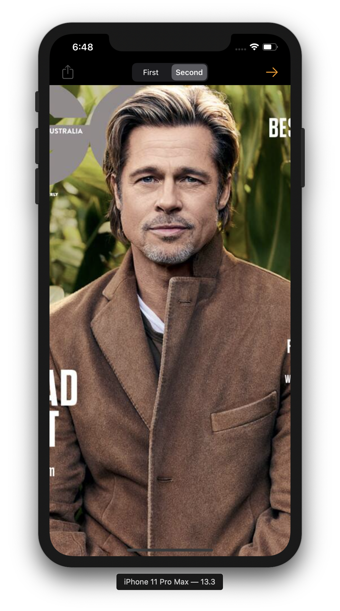
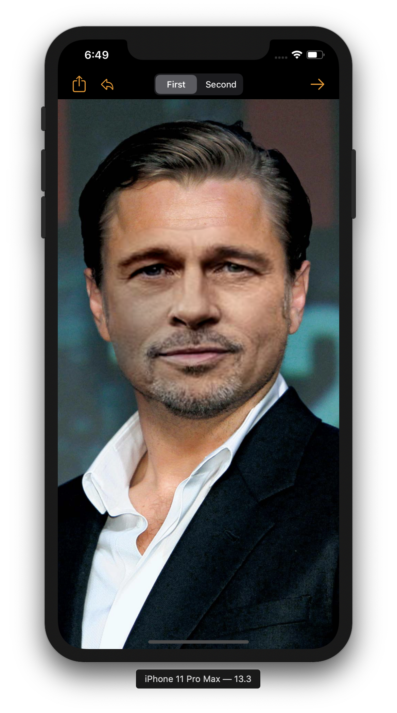
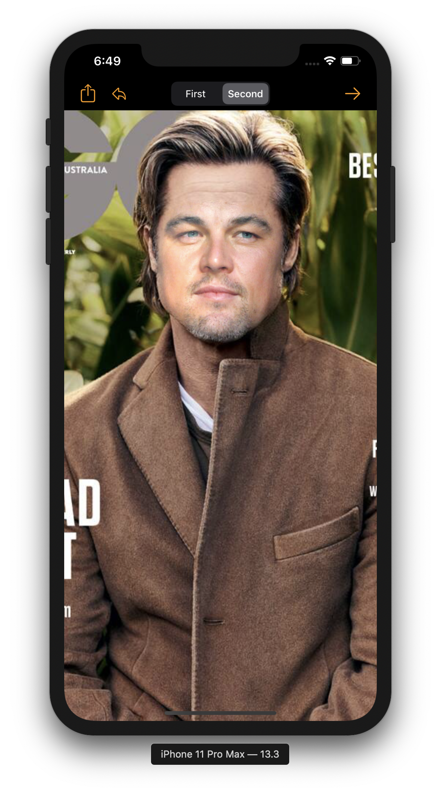

FaceSwap iOS
==================

Face swap for iOS. 

## Background
In 2018 I decided to publish code for face swapping in Android [here](https://github.com/alex011235/FaceSwap_Android). I also made a face swap app for iOS. 

Previous implementation depended on [dlib](http://dlib.net), but it was a bit tricky to compile dlib for iOS. When Apple announced that they will support [facial landmarks](https://developer.apple.com/documentation/vision/vnfacelandmarks?language=objc) detection in iOS dlib was ditched. Facial landmarks are coordinates detected in a face observation. See image below for example of landmarks used. Note that all facial landmarks have not been used. Facial landmarks for eyes, mouth and nose were discarded since these will not be used by the swap algorithm. Furthermore, the landmarks coordinates for the eyebrows were adjusted slightly to incude a bit of the forehead. Without adjusting those coordinates, the face swap might result in two kinds of eyebrows overlapping each other.

## Dependencies
The app depends on OpenCV. It should be straightforward to add the OpenCV library to Xcode. The code that depend on OpenCV is Objective-C++ (.mm). There is a bridging-header provided not to expose C++ code to Swift.

Note that the OpenCV framework has to be imported to Xcode in order to include it in the project. Unzip `opencv2.framework.zip`, drag it to Xcode and select "Copy items if needed".

To make Xcode understand that the framework exists, see the images below:

## App interface
Really simple. A segment button to switch between the input photos. Tap on the screen to select photo from the camera roll. Then press the arrow to swap faces. When face swap is finished, tap the action button to share the result.

### Interface

### Input example
Thank you Leonardo and Brad for lending your faces.

  
   

### Result

  
   

### Share result
   
